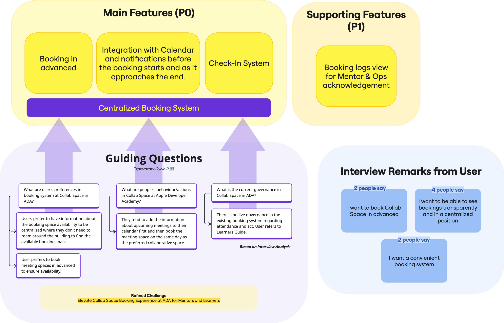
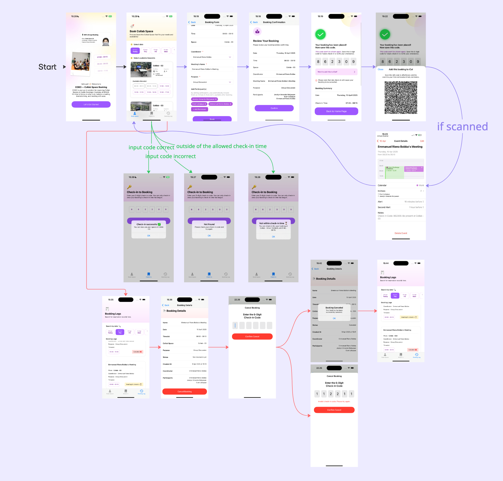
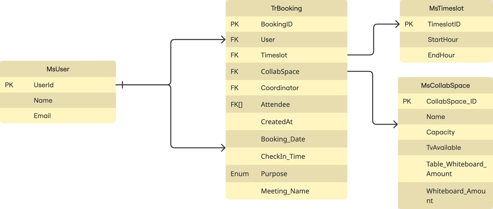

# CoBo - Collab Space Booking App

Made by: **Evan**, **Amanda**, **Bobba**

---

## 📌 Overview

**CoBo** is a streamlined booking app designed to enhance the Collab Space reservation experience at the Apple Developer Academy (ADA). Built with a user-first mindset, CoBo aims to eliminate the hassle of manual bookings by offering a centralized and intuitive system for both Mentors and Learners.

---

## 🔍 Establishing CoBo as a Concept

To explore existing problems, we conducted observations and interviews with potential users at the academy. We narrowed our analysis to a specific challenge: improving the Collab Space booking experience for both Mentors and Learners.

To better understand user behavior, we interviewed current users as well as an alumnus, gaining insights into how the space was previously used. These findings helped us identify recurring pain points and allowed us to prioritize features that would offer the most impact in solving them.

---

## 🧠 Designing User Flow, LoFi, and HiFi

We started with the **Crazy 8** method to generate initial ideas, then created low-fidelity prototypes using **Balsamiq**. These prototypes were printed out and tested with users to validate our design assumptions and usability.

Through concept testing, we found that CoBo’s design effectively addressed existing pain points. However, we also discovered opportunities to reduce cognitive load and simplify navigation:
- Booking flow: reduced from 4 pages to 3
- Check-in flow: reduced from 3 pages to 1
- Added a **Cancel** feature to give users more control over their reservations

These improvements led us into the high-fidelity design phase and significantly improved the user experience.

---

## 🧩 Architecture & Tech Stack

We implemented the **MVC (Model-View-Controller)** architecture for a clean and maintainable codebase.

- **Model**: Represents booking data, user information, and system states. Persisted using **SwiftData**.
- **View**: Provides the user interface for seamless interaction.
- **Controller**: Handles logic, updates the model, and manages user interactions.
- **CoreImage**: Used to generate **QR codes** that include iCal-compatible event details.
- **iCal Integration**: Allows users to add bookings to their calendar.
- **SwiftData**: Logs booking activity, collab space, and users.

Here's a visual of our ERD:

---
A heartfelt thank you to our mentor, Ko Wil, for consistently checking in and supporting us throughout the process. We also extend our gratitude to all the mentors and learners who shared their insights with us through interviews and concept testing!

